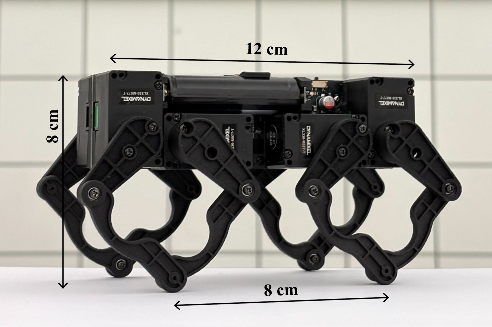
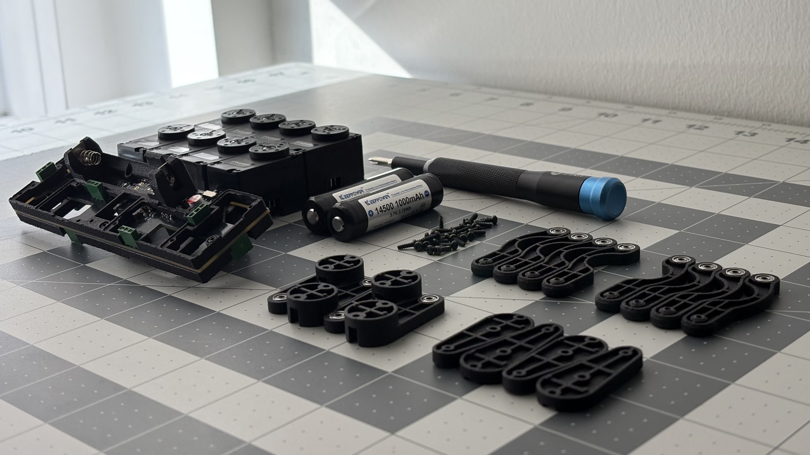

# Q8bot Quadruped

Q8bot is a miniature quadruped robot with the size and weight comparable to a modern smartphone. This robot is capable of dynamic movements like walking, trotting, bounding, jumping, and more. It also has NO WIRES AND CABLES - everything is directly plugged into the center PCB, greatly reducing complexity, weight, and cost. The current **[Bill of Materials (BOM)](https://docs.google.com/spreadsheets/d/1M1K_Dghia-Mn2t4RStW8juN6r4e3I3OBy6M_fPFHzs8/edit?usp=sharing)**, without optimization, ranges between $300 - $400 depending on the listed options. 

  
  
  

## LATEST UPDATE: 11/06/2025

I've published python-tool v1.2.0 in Releases. It adds support for common joysticks, including Xbox controllers and Nintendo Switch Joy‑Con. Note that you'll still need a laptop and a wireless dongle to run Q8bot—the joystick provides more granular movement control than the discrete WASD keyboard commands.

The updated python-tool also has a refreshed pygame interface that is no longer a blank screen :D.

  
  

**For a full history of updates, please go to [UPDATES.md](UPDATES.md)**

## Featured Media & Demos
Q8bot's capabilities: [IROS Video](https://youtu.be/0dk7lYoITQw) 

Detailed building process: [YouTube Video](https://youtu.be/YJDc1xAhaOI)

Q8bot is lucky to be featured in a number of blog posts:
- Hackaday: https://hackaday.com/2024/10/29/little-quadruped-has-pcb-spine-and-no-wiring/#comments
- Hackster.io: https://www.hackster.io/news/a-step-up-for-diy-robotics-8b04a2320861?f=1
- Interesting Engineering: https://interestingengineering.com/innovation/palm-sized-quadruped-robot-redefines-design

## Publications
- Design: https://arxiv.org/abs/2508.01149
- Control & Data Acquisition: https://ieeexplore.ieee.org/abstract/document/11078123/

## Open Source Information
Q8bot is 100% open source: In this repository, you will find everything you need - STEP, STL, Gerber, Schematics, bill of materials (BOM), instructions, and more - to build your own version. 

**You can now ordered the fully-assembled PCB via PCBWay!** This [project page](https://www.pcbway.com/project/shareproject/Q8bot_PCB_Robot_dfa65114.html) contains all of the assembly-related files (BOM, centroid, etc.) and simplifies the ordering process.

    

I’m working on turning Q8bot into a purchasable kit, though I’m not sure when or if it will happen. In the meantime, I encourage you to build your own Q8bot! This palm-sized quadruped is perfect for robotics education, swarm robotics research, or simply as a fun engineering project. If you have any questions, feel free to reach out and I will try my best to help. **If you have built your own Q8bot, please consider sending photos or videos to me! I would love to feature your creation here publically with your permission!**

Personal: yufeng.wu0902@gmail.com

School: ericyufengwu@ucla.edu

## Building Instruction
The building instructions have moved to a dedicated folder:

[Sourcing Components](docs/instructions/sourcing_components.md)

[Assembling the Robot](docs/instructions/robot_assembly.md)

[Software Setup](docs/instructions/software_setup.md)

## Compatibility & Recommended Versions

Below is a reference matrix showing which hardware, firmware, and Python tool versions
have been tested together.

### 🧩 Compatibility Matrix

| Component ↔ | **Hardware v2.2** | **Hardware v2.4** | Notes |
|--------------|------------------|------------------|--------|
| **Firmware v1.0.0 – v1.9.x** | ✅ Compatible | ✅ Compatible | Legacy firmware (pre-ESP-NOW). |
| **Firmware v2.0.0 – v2.0.1** | ✅ Compatible | ✅ **Recommended** | ESP-NOW stack; tested primarily on HW v2.4. |
| **Python Tools v1.0.0** | ✅ Compatible | ✅ Compatible | Initial host stack. |
| **Python Tools v1.1.0+** | ✅ Compatible | ✅ **Recommended** | Latest host utilities; tested with FW v2.0.1 + HW v2.4. |

✅ = Compatible  ✅ **Recommended** = Officially tested combination  
⚠️ Legacy = Functional but not regularly tested

### 🧭 Recommended Configuration

| Component | Version | Tag / Link |
|------------|----------|------------|
| **Hardware** | v2.4 | [hw-v2.4](https://github.com/EricYufengWu/q8bot/releases/tag/hw-v2.4) |
| **Firmware** | v2.0.1 | [fw-v2.0.1](https://github.com/EricYufengWu/q8bot/releases/tag/fw-v2.0.1) |
| **Python Tools** | v1.1.0 | [python-tools-v1.1.0](https://github.com/EricYufengWu/q8bot/releases/tag/python-tools-v1.1.0) |

---

## Note on Project Ownership
Q8bot is currently considered as a project at the [UCLA Robotics and Mechanisms Lab (RoMeLa)](https://www.romela.org/). I am grateful for the support from Dr. Dennis Hong and fellow RoMeLa members in helping publish my work as an academic research paper.

That said, since Q8bot was originally conceived and developed independently prior to my time at UCLA, I will retain full ownership of the original design after graduation. Given the project’s open-source nature, RoMeLa will have the freedom to continue developing, modifying, and publishing research based on the platform. A derived successor design is currently under development and will be owned by RoMeLa.