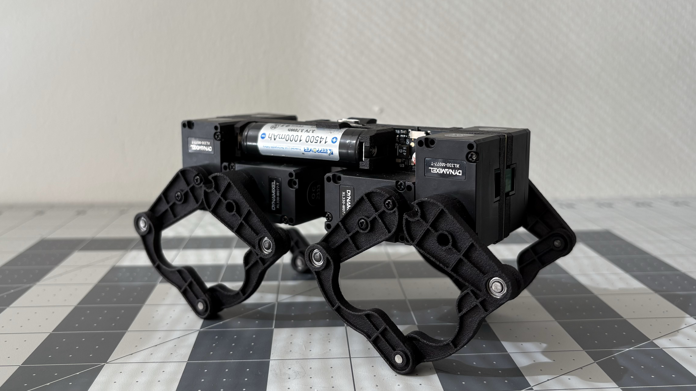
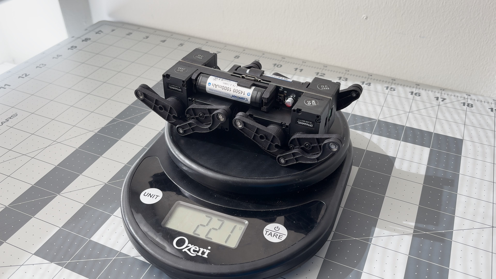
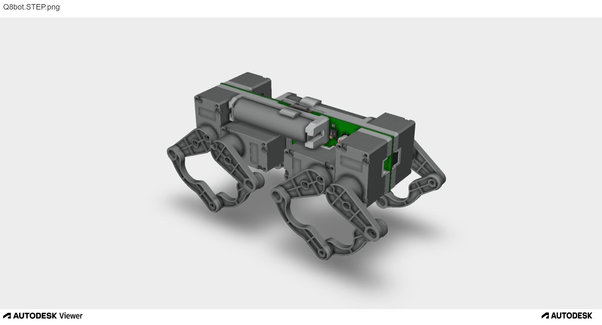
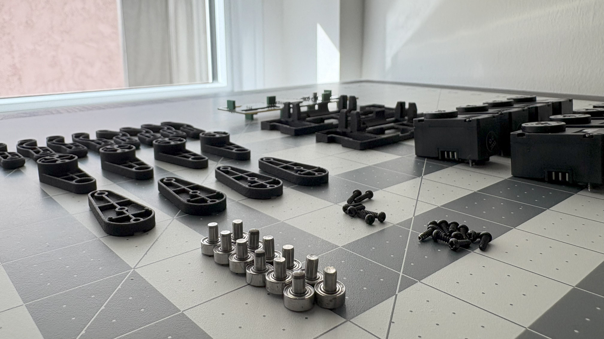
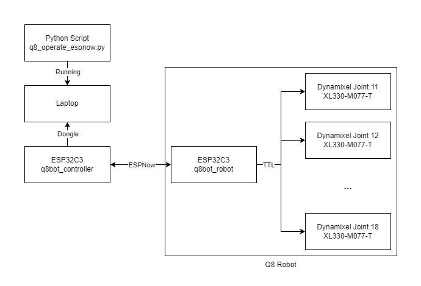
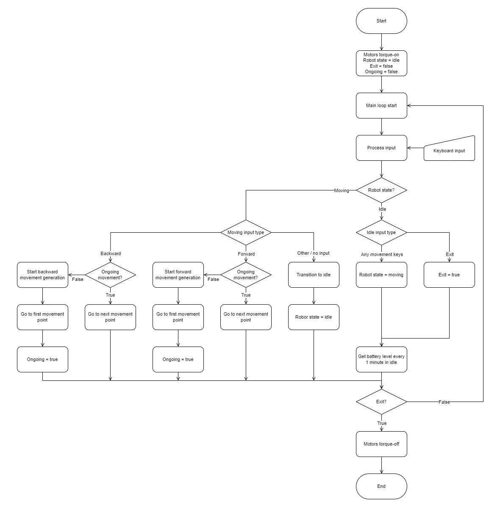

# Q8bot PCB Robot

Q8bot is a miniature quadruped robot powered by 8 Dynamixel motors and a [Seeed Studio XIAO ESP32C3](https://www.seeedstudio.com/Seeed-XIAO-ESP32C3-p-5431.html).

The robot weighs around 221g and is capable of dynamic movements like jumping and various gaits (WIP). It also has no wires and cables - everything is directly plugged into the center PCB, greatly reducing complexity, weight, and cost.

The current BOM, without optimization, starts below $300. 

  
  

## Design Files

**01/08/2025 Update: Component U2 should be 74LVC2G241GT, not 74LVC2G241GS. The BOM and schematics have been updated to reflect this change.** 

Q8bot is 99% open source: In this repo, you will find everything you need - STEP, STL, Gerber, Schematics, BOM, and more - to build your own version. 

**You can now ordered the fully-assembled PCB via PCBWay!** This [project page](https://www.pcbway.com/project/shareproject/Q8bot_PCB_Robot_dfa65114.html) contains all of the assembly-related files (BOM, centroid, etc.) and simplifies the ordering process.

    

Although I do not plan to constantly maintain this project due to availability, feel free to reach out with questions and I will try my best to answer: yufeng.wu0902@gmail.com 

Access the bill of materials (BOM) **[here](https://docs.google.com/spreadsheets/d/1M1K_Dghia-Mn2t4RStW8juN6r4e3I3OBy6M_fPFHzs8/edit?usp=sharing)**. Build the optional USB dongle for easier robot control by following instructions [here](https://github.com/EricYufengWu/ESPNowDongle). This is not included in the main BOM as there are other ways to control Q8bot (WiFi, BLE, etc.)

## Building Instructions

While there are no detailed building instruction for Q8bot yet, you can use the YouTube video with the following simplified steps as reference:
1. Obtain all components folling the bill of materials (BOM), including the PCB and 3D-printed parts.

2. Solder SMD and THT components to the PCB (skip if using PCBWay's assembly service).

3. Install battery clips to the Q8bot_Frame 3D-printed part. Verify their locations as this is important for battery polarity. Secure both copies of Q8bot_Frame to the PCB with screws and Solder the battery clips to the PCB.

4. If you are using brand-new Dynamixel actuators, they need to individually configured. There are 2 ways to do this:

    1. Manually: If you have an [U2D2 Hub](https://www.robotis.us/u2d2) from Robotis, you can use the [Dynamixel Wizard](https://emanual.robotis.com/docs/en/software/dynamixel/dynamixel_wizard2/) tool to configure each motor prior to attaching them during assembly. Follow [this instruction](documentation_public/DXL_config_manual.md). , 
    2. Automatically: upload and run the motor initialization code on the Seeed Studio XIAO and follow the instructions on the serial monitor. **This is still WIP**. If you don't have an U2D2 you can try to write your own set of instructions to change the parameters (you can follow examples in the [Dynamixel2Arduino library](https://github.com/ROBOTIS-GIT/Dynamixel2Arduino)).

5. Once all motors are configured and installed, it is recommended to go through the software setup and power up the robot without legs first to ensure correct joint configuration. Please go through Software Setup before returning to step 6.

6. Build individual leg linkages following the YouTube video. Note that two legs on each sides are identical and the left/right pairs should be mirrored.

7. Power up the robot again with its legs attached, and have fun!

## Software Setup

Please excuse my messy code as I am a mechanical engineer by training :D

Currently, all computation regarding gait generation and FK/IK happens on the laptop. The laptop talks to the robot remotely via another Seeed Studio XIAO ESP32C3, sending raw joint angles as rapidly as possible using the ESPNow protocol. In the future, the hope is to move the gait generation code to the robot's onboard ESP32 for improved control.

    

### Seeed Studio XIAO MCU Setup (Robot + Controller)

The microcontroller part of the code is developed in [PlatformIO](https://platformio.org/). If you haven't used it before, please refer to official documentation and tutorials to setup the environment. Someone has also tried converting PlatformIO projects to Arduino IDE script [here](https://runningdeveloper.com/blog/platformio-project-to-arduino-ide/).

Open the folder "q8bot_robot" with PlatformIO and upload it to Q8bot's XIAO board.

Currently, Q8bot uses another ESP32C3 connected to the host PC/laptop. Whether you are using the additional XIAO board as is or in its [dongle form](https://github.com/EricYufengWu/ESPNowDongle), you need to open the folder "q8bot_controller" with PlatformIO and upload it to the controller board.

The MAC address in the controller's code need to be modified to match the address of your robot board.

### Python Setup
Navigate to the `/q8bot_python` folder and run:

    pip install -r requirements.txt

This will install necessary dependencies (there aren't alot so you mey have already had all libraries installed).

Modify the COM port value in `/q8bot_python/q8bot/q8_operate.py` to match the COM port of your controller board.

    PORT = 'COM6' 

### Running the Robot
Attach the batteries to the robot (double-check polarity!). Power on the robot with the onboard slide switch and you should see the onboard LED light up.

Plug in the controller board to your laptop/PC.

Navigate to `/q8bot_python/q8bot` folder and run:

    python q8_operate.py

If everything works, you should see a small pygame window pop up and the robot move its joints to their initial location. Robot keyboard control instructions are as follows:
- WASD for robot movement.
- J for jumping.
- Keyboard up and down for adjusting robot stance.
- "+" and "-" for adjusting stride size.

## Appendix

Here's a rough overview to the logic behind the python script (might not be accurate as I keep adding features)

