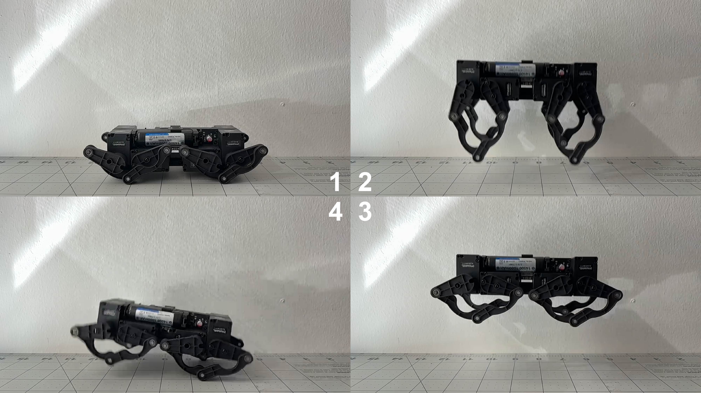

# Q8 PCB Robot

Q8bot is a miniature quadruped robot powered by 8 Dynamixel motors and a Seeed Studio XIAO ESP32C3.

The robot weighs around 221g and is capable of dynamic movements like jumping and various gaits (WIP). It also has no wires and cables - everything is directly plugged into the center PCB, greatly reducing complexity, weight, and cost.

The current BOM, without optimization, is about $300. 

# Design Files

Q8bot is 99% open source: In this repo, you will find everything you need - STEP, STL, Gerber, Schematics, BOM, and more - to build your own version. 

Although I do not plan to constantly maintain this project due to availability, feel free to reach out with questions and I will try my best to answer: yufeng.wu0902@gmail.com 

Checkout the bill of materials (BOM) here:
https://docs.google.com/spreadsheets/d/1M1K_Dghia-Mn2t4RStW8juN6r4e3I3OBy6M_fPFHzs8/edit?usp=sharing

## Software Architecture

Please excuse my messy code as I am a mechanical engineer by training :)

Currently, all computation regarding gait generatio and FK/IK happens on the laptop. The laptop talks to the robot remotely via an ESP32C3 Microcontroller dongle, sending raw joint angles as rapidly as possible using the ESPNow protocol.

Here's a rough overview to the logic behind the python script (might not be accurate as I keep adding features)

