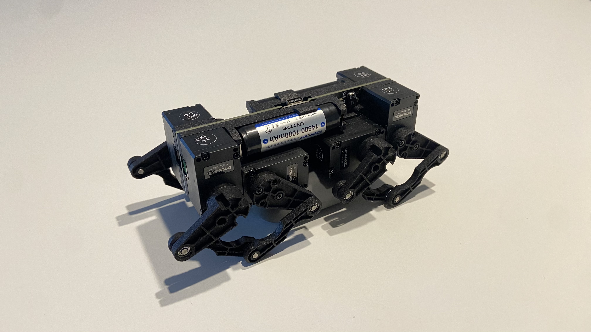

# Q8 PCB Robot

Q8bot is a miniature quadruped robot powered by 8 Dynamixel motors and a Seeed Studio XIAO ESP32C3.

The robot weighs under 250g and is capable of dynamic movements like jumping and various gaits (WIP). It also has no wires and cables - everything is directly plugged into the center PCB, greatly reducing complexity, weight, and cost.

The current BOM, without optimization, is less than $400. 

## Software Architecture

Currently, all computation regarding gait generatio and FK/IK happens on the laptop. The laptop talks to the robot remotely via an ESP32C3 Microcontroller dongle, sending raw joint angles as rapidly as possible using the ESPNow protocol.

Here's a rough overview to the logic behind the python script (might not be accurate as I keep adding features)

