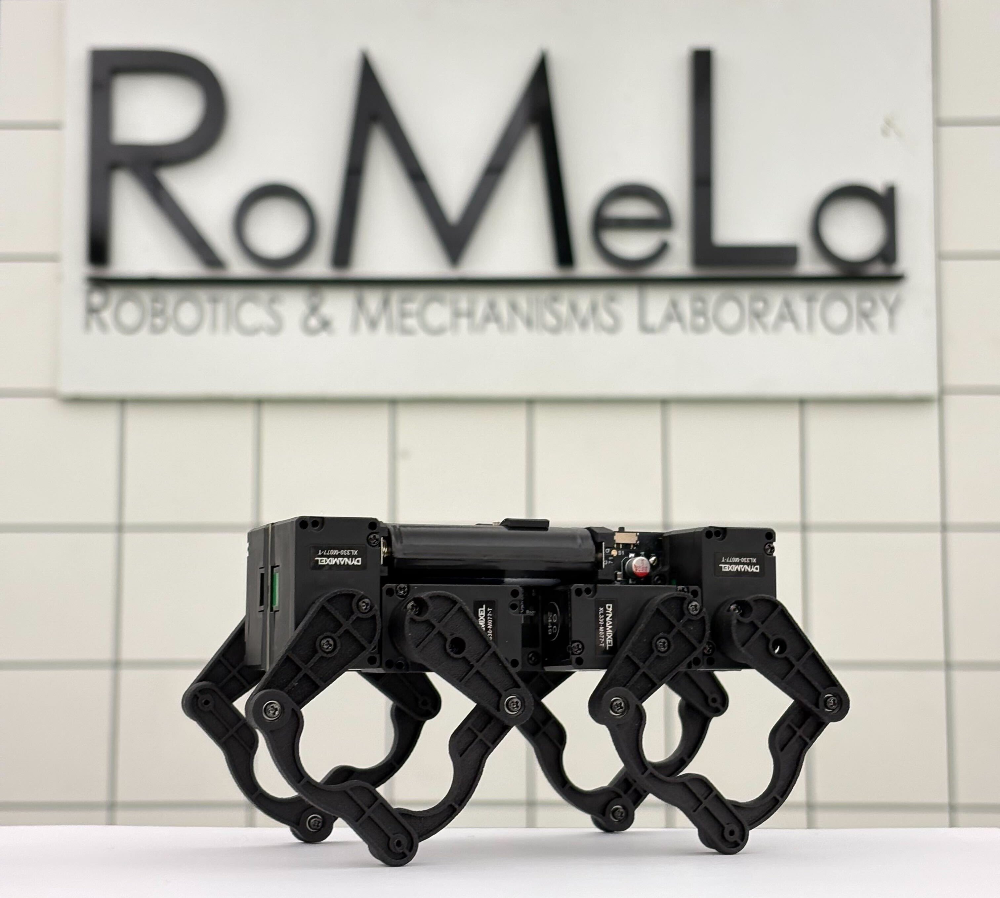
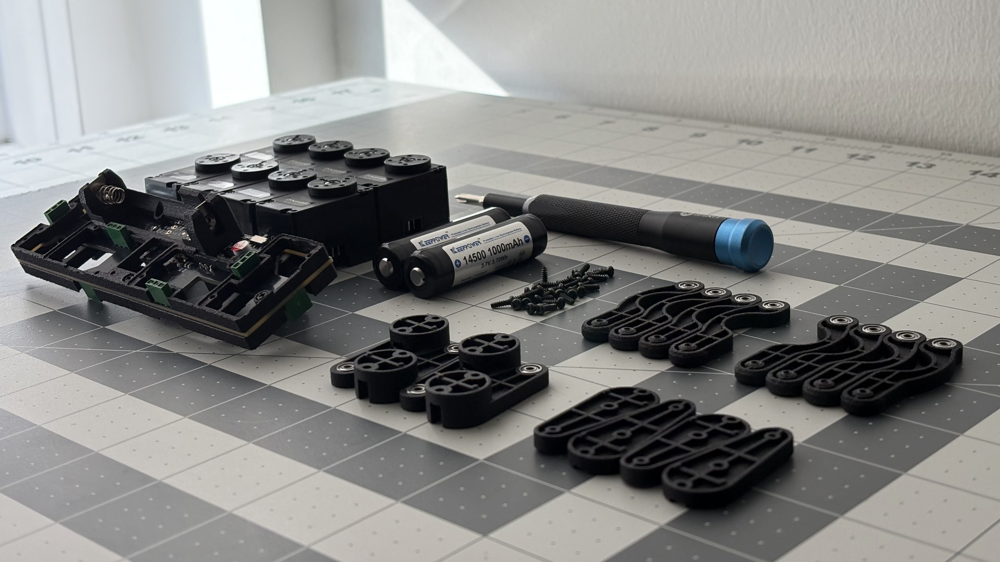

# Q8bot Quadruped

**03/03/2025 Update: Q8bot is now a research project at the [UCLA Robotics and Mechanisms Lab (RoMeLa)](https://www.romela.org/). The open-source nature of this project remains unchanged. We are working on an improved version of this platform and will potentially release it under a different name. Stay tuned!** 

## Featured Media & Demos

Q8bot was recently featured in a [tour video](https://youtu.be/FAo-BCnxW9A?si=LB-HlDlHGtaq-xd7&t=1208) by UnrealScience, a famous Korean science Youtube channel.

[This video]() demonstrates the latest capabilities of the robot, made possibly by ongoing improvements in software control and mechanical design. (link coming soon!).

See the detailed robot building process on [YouTube](https://youtu.be/YJDc1xAhaOI)!

## Overview

Q8bot is a miniature quadruped robot with the size and weight comparable to a modern smartphone. This robot is capable of dynamic movements like walking, trotting, bounding, jumping, and more. It also has NO WIRES AND CABLES - everything is directly plugged into the center PCB, greatly reducing complexity, weight, and cost. The current BOM, without optimization, starts below $300. 

  
  
  
  

Q8bot is 100% open source: In this repository, you will find everything you need - STEP, STL, Gerber, Schematics, bill of materials (BOM), instructions, and more - to build your own version. 

**You can now ordered the fully-assembled PCB via PCBWay!** This [project page](https://www.pcbway.com/project/shareproject/Q8bot_PCB_Robot_dfa65114.html) contains all of the assembly-related files (BOM, centroid, etc.) and simplifies the ordering process.

    

I’m working on turning Q8bot into a purchasable kit, though I’m not sure when or if it will happen. In the meantime, I encourage you to build your own Q8bot! This palm-sized quadruped is perfect for robotics education, swarm robotics research, or simply as a fun engineering project. If you have any questions, feel free to reach out and I will try my best to help. 

Personal: yufeng.wu0902@gmail.com

School: ericyufengwu@ucla.edu

## Building Instruction

The building instructions have moved to a dedicated folder:

[Sourcing Components](building_instructions/sourcing_components.md)

[Assembling the Robot](building_instructions/robot_assembly.md)

[Software Setup](building_instructions/software_setup.md)

