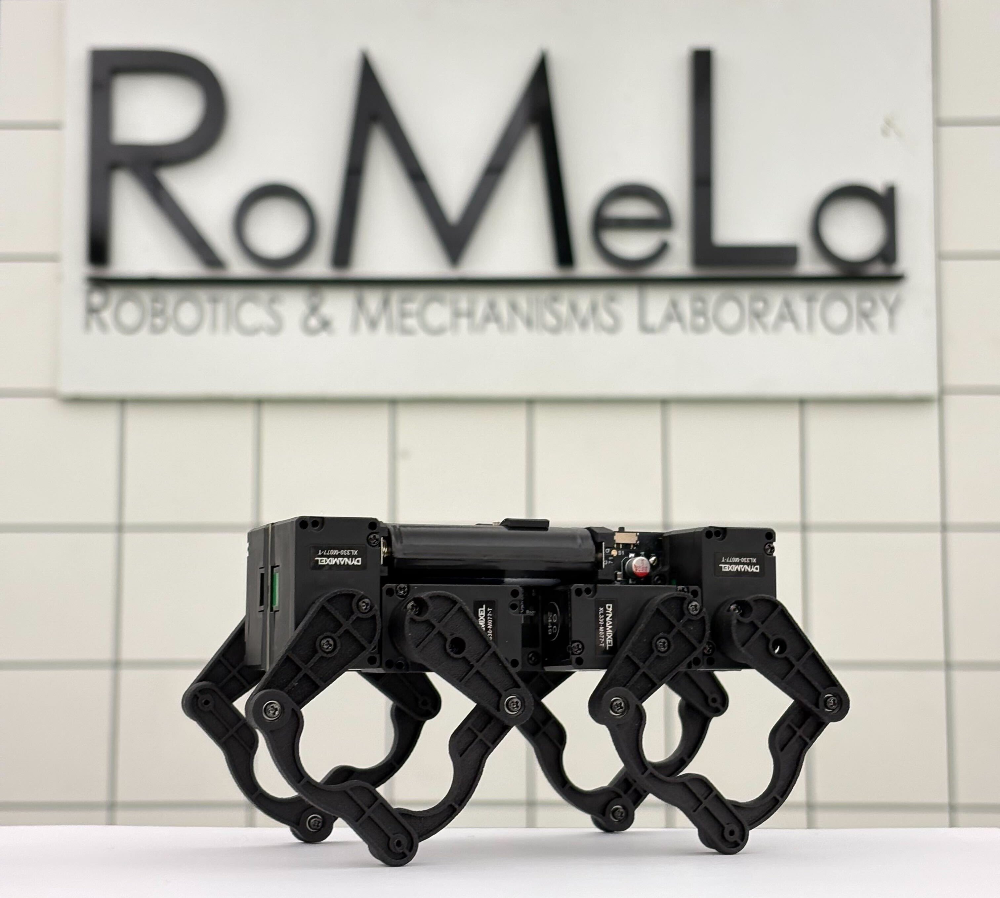

# Q8bot Project Updates

**[BACK TO PROJECT README](README.md)**

### 07/18/2025 Publication Update
My paper on Q8bot's remote gait computation and data collection architecture was published on IEEE Xplore: https://ieeexplore.ieee.org/abstract/document/11078123/

### 04/28/2025 Media Feature
Q8bot was recently featured in a [tour video](https://youtu.be/FAo-BCnxW9A?si=LB-HlDlHGtaq-xd7&t=1208) by UnrealScience, a famous Korean science Youtube channel.

### 03/03/2025 Project Update
 Update: Q8bot is now a research project at the [UCLA Robotics and Mechanisms Lab (RoMeLa)](https://www.romela.org/). The open-source nature of this project remains unchanged. We are working on an improved version of this platform and will potentially release it under a different name. Stay tuned!** 

