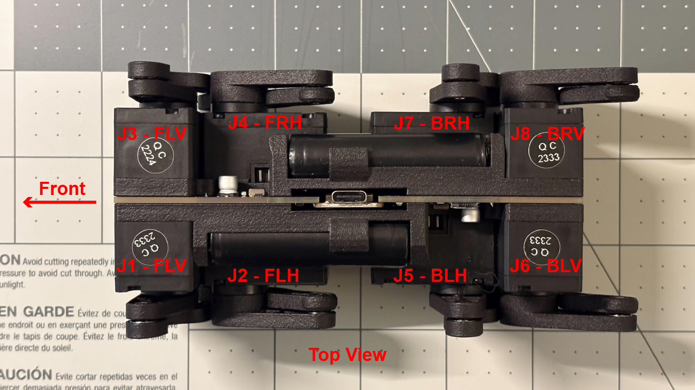

# Robot Assembly Instructions

[Sourcing Components](sourcing_components.md)

[**Assembling the Robot**]()

[Software Setup](software_setup.md)

[Back to Project Page](https://github.com/EricYufengWu/q8bot)

While there are no detailed building instruction for Q8bot yet, you can use the YouTube video with the following simplified steps as reference:
1. Obtain all components following the bill of materials (BOM), including the PCB and 3D-printed parts.

2. Solder SMD and THT components to the PCB (skip if using PCBWay's assembly service).

3. Install battery clips to the Q8bot_Frame 3D-printed part. Verify their locations as this is important for battery polarity. Secure both copies of Q8bot_Frame to the PCB with screws and Solder the battery clips to the PCB.

4. If you are using brand-new Dynamixel actuators, they need to individually configured. There are 2 ways to do this:

    1. Manually: If you have an [U2D2 Hub](https://www.robotis.us/u2d2) from Robotis, you can use the [Dynamixel Wizard](https://emanual.robotis.com/docs/en/software/dynamixel/dynamixel_wizard2/) tool to configure each motor prior to attaching them during assembly. Follow [this instruction](documentation_public/DXL_config_manual.md). 
    2. Automatically: upload and run the [motor initialization code](/q8bot_cpp/q8bot_motor_config/) on the Seeed Studio XIAO on the fully assembled robot PCB. Connect your board to the laptop/PC and open a serial monitor. Connect new Dynamixel motors into the robot PCB one-by-one, starting at the location of J1 (see picture below) and the serial monitor should indicate whether motor configuration was successful. Detailed instruction video coming soon!

    

5. Once all motors are configured and installed, it is recommended to go through the software setup and power up the robot without legs first to ensure correct joint configuration. Please go through Software Setup before returning to step 6.

6. Build individual leg linkages following the YouTube video. Note that two legs on each sides are identical and the left/right pairs should be mirrored.

7. Power up the robot again with its legs attached, and have fun!