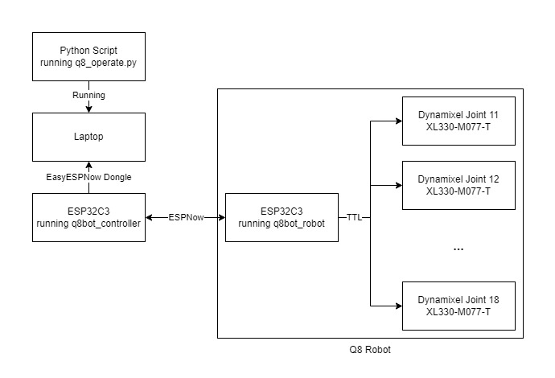
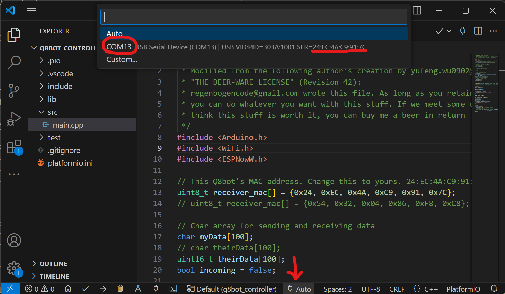
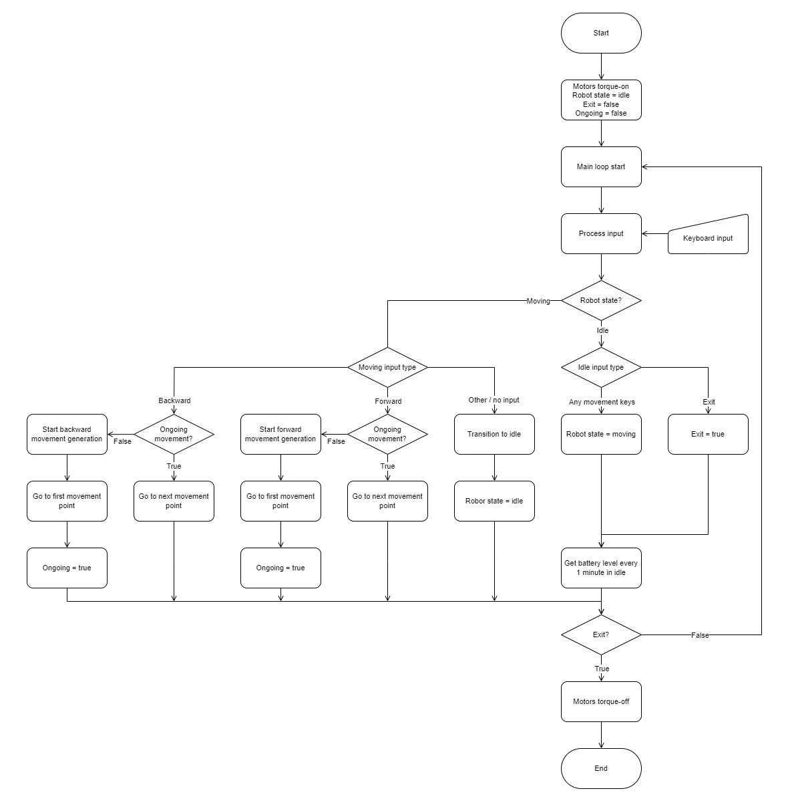

# Software Setup Instructions

[Sourcing Components](sourcing_components.md)

[Assembling the Robot](robot_assembly.md)

[**Software Setup**]()

[Back to Project Page](https://github.com/EricYufengWu/q8bot)

## Software Overview

Please excuse my messy code as I am a mechanical engineer by training :D

Currently, all computation regarding gait generation and FK/IK happens on the laptop. The laptop talks to the robot remotely via another Seeed Studio XIAO ESP32C3, sending raw joint angles as rapidly as possible using the ESPNow protocol. In the future, the hope is to move the gait generation code to the robot's onboard ESP32 for improved control.

    

## Seeed Studio XIAO MCU Setup (Robot + Controller)

The microcontroller part of the code is developed in [PlatformIO](https://platformio.org/). If you haven't used it before, please refer to their official documentation and tutorials to setup the environment. Someone has also tried converting PlatformIO projects to Arduino IDE script [here](https://runningdeveloper.com/blog/platformio-project-to-arduino-ide/).

Different firmware need to be uploaded to Q8bot ("robot") and the separate Seeed Studio XIAO ESP32C3 ("controller"): `q8bot_cpp/q8bot_robot` and `q8bot_cpp/q8bot_controller`. Before they are ready to upload, you need to:
- Navigate to `q8bot_cpp/q8bot_robot/main.cpp` and update the MAC address to match your controller
- Navigate to `q8bot_cpp/q8bot_controller/main.cpp` and update the MAC address to match your robot.
- A quick way to find the MAC address of your device is by selecting the specific COM port in PlatformIO.

    

Upload `q8bot_cpp/q8bot_robot` to the Q8bot PCB, and upload `q8bot_cpp/q8bot_controller` to the separate Seeed Studio XIAO board to use it as a wireless control dongle. The process will be similar to steps 10 - 13 in [Robot Assembly](robot_assembly.md), 

## Python Setup
Navigate to the `/q8bot_python` folder and run:

    pip install -r requirements.txt

This will install necessary dependencies (there aren't alot so you mey have already had all libraries installed).

Modify the COM port value in `/q8bot_python/q8bot/q8_operate.py` to match the COM port of your controller board.

    PORT = 'COM6' 

### Running the Robot
Attach the batteries to the robot (double-check polarity!). Power on the robot with the onboard slide switch and you should see the onboard LED light up.

Plug in the controller board to your laptop/PC.

Navigate to `/q8bot_python/q8bot` folder and run:

    python q8_operate.py

If everything works, you should see a small pygame window pop up and the robot move its joints to their initial location. Robot keyboard control instructions are as follows:
- WASD for robot movement. Q and E are used to partial turning in amber gait.
- G two cycle between different gaits.
- J for jumping.
- Keyboard up and down for adjusting robot stance.
- "+" and "-" for adjusting stride size.
- R for resetting stance, size, etc.
- (More functions comming soon).

## Appendix

Here's a rough overview to the logic behind the python script (might not be accurate as I keep adding features)

