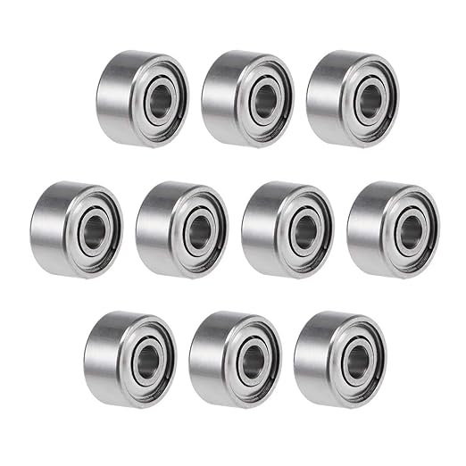

# Components Sourcing Instructions

[**Sourcing Components**]()

[Assembling the Robot](robot_assembly.md)

[Software Setup](software_setup.md)

[Back to Project Page](https://github.com/EricYufengWu/q8bot)

**The complete bill of materials (BOM) of Q8bot can be accessed [here](https://docs.google.com/spreadsheets/d/1M1K_Dghia-Mn2t4RStW8juN6r4e3I3OBy6M_fPFHzs8/edit?usp=sharing)**. The links and prices are mainly for purchasing within the US. To accommodate different users, we've set up multiple "tiers" based on the tools you might have available. Please read the following sections carefully to choose the build configuration that works best for you. 

The BOM of this robot is so short that I can afford to explain every single component in detail :D

## Required Tools
This instruction assumes you have the following tools at a minimum:
- A PH-0 or JIS-1 screwdriver.
- A soldering iron with basic consumables.
- A modern laptop capable of running Microsoft Visual Studio Code.
- A USB Type-A to Type-C (or Type-C to Type-C) cable.

## Off-The-Shelf Components
These are the components you need to purchase regardless of build configurations.

[Dynamixel XL330-M077-T](https://www.robotis.us/dynamixel-xl330-m077-t/): You need a total of **8 motors** for the robot. Each motor comes with a set of M2 self-tapping screws, which will be used to assemble Q8bot.

    

[692ZZ Ball Bearing](https://www.amazon.com/uxcell-Groove-Bearings-Double-Shielded/dp/B082PR238V/ref=sr_1_2): You need a total of **12 bearings** with the trade number **692ZZ** (2mm x 6mm x 3mm). At the time of this writing, Amazon only sells them for pack of 10, so you'll end up with some extras. You can probably find cheaper alternatives on AliExpress or Ebay - any bearing with the same dimensions will work.

    

[14500 KeepPower 1000mAh P1450C2](https://illumn.com/14500-keeppower-1000mah-p1450c2-protected-button-top.html): You need **2 batteries** to run the robot and can purchase more pairs for hot-swapping. Keep in mind that these are Lithium-ion batteries in a AA form-factor, but **regular AA batteries will not work**. This particular model also has a built-in protection circuit so it is safer to work with.

    

## Main PCB
There are two options for acquiring the main PCB for Q8bot.

### Option 1: Purchase A Fully-Assembled Board from PCBWay
  [This link](https://www.pcbway.com/project/shareproject/Q8bot_PCB_Robot_dfa65114.html) takes you to a PCBWay project page, contains all of the assembly-related files (BOM, centroid, etc.). You can simply  select "PCB+Assembly" and order the fully-assembled PCB (including headers and the micro-controller).

    
    

However, you will still need to purchase some battery clips which will go into the 3D-printed main frames to hold the batteries. [This link](https://www.digikey.com/short/8w05tttf) directs you to a DigiKey shopping cart that contains 2x 1087-1 and 2x 1087-2 from Keystone Electronics.

    
    

### Option 2: Purchase Components and Reflow Yourself
You can order the blank PCB from JLC, PCBWay, or similar, and order the components separately to assemble the PCB youself. The zipped Gerber files, along with a read-friendly pick-and-place file, can be found under the `/PCBA` folder. Remember to also order stencils (top and bottom) when purchasing the blank PCBs. 

I used a [MHP50](https://www.adafruit.com/product/5903) mini hot plate and a stencil holder setup similar to [this one](https://youtu.be/F9zNtQTpbms?si=rfB_CtxsjbDME_TU). See my [YouTube video](https://youtu.be/YJDc1xAhaOI) for details. 

    

[This link](https://www.digikey.com/short/n7vrz77m) directs you to a DigiKey shopping cart that contains all required PCB components, including the battery clips from earlier.

## 3D-Printed Parts
There are 2 options for 3D-printing parts for Q8bot. Regardless of outsourcing or printing them yourselves, you will need the following quantity to build 1x Q8bot. It never hurts to print/order some extras in case the robot breaks.
- `Q8bt_Frame`: Print 2.
- `Q8bot_LL_Left`: Print 4.
- `Q8bot_LL_Right`: Print 4.
- `Q8bot_UL1`: Print 4.
- `Q8bot_UL2`: Print 4.

### Option 1: Order MJF parts from Online Vendors
Multi Jet Fusion (MJF) is an isotropic 3D-printing technology similar to SLS. Many domestic and international companies offer printing service with relatively affordable price. To order, you typically need to upload the .STL files in the `/CAD/Q8_VX.X_MJF` folder to the vendor's website and configure the materials and quantity. I ordered the MJF parts together with my JLCPCB order to simplify the purchasing process.

### Option 2: 3D-Print Yourself using FDM
If you own a Bambu Lab, Prusa, or similar 3D-printer, you can print the parts yourself by downloading and slicing the files under `/CAD/Q8_VX.X_FDM`. I printed mine on a Bambu Lab A1 mini with the default 0.12mm settings. **The cost of filament is less than $1 for a $20 spool.**

Here is a table comparing MJF and FDM 3D-printed parts:

| MJF Outsourcing | FDM Print-it-Yourself |
|-----------------|-----------------------|
|  ||
| More expensive :x: | Less expensive :white_check_mark: |
| Saves time :white_check_mark: | Takes more time :x: |
| Surface finish gives a "product" vibe :white_check_mark: | Visible layer lines on parts :x: |
| Has extra geometry that makes assembly easier :white_check_mark: | No extra geometry :x: |
| Difficult to replace :x: | Easy to re-print and modify :white_check_mark: |
| Breaks first to protect motors* | Motors might break due to transferred impact* |
_*Not rigorously tested. Robot survives 1-meter drop during preliminary testing_

## Other Recommended Components
**Li-ion battery charger:** If you don't already have one, you probably also want to pick up a charger like [this one](https://www.amazon.com/EBL-Battery-Charger-Rechargeable-Technology/dp/B01D9TUL8Y/). In the future, I plan to add battery charging functionality to the PCB so you no longer have to buy a separate charger.

**ESPNow Dongle:** The current software architecture uses an ESP32C3 microcontroller connected to the laptop to wirelessly communicate with the robot. You can build an optional USB dongle by following instructions [here](https://github.com/EricYufengWu/ESPNowDongle). 

    

