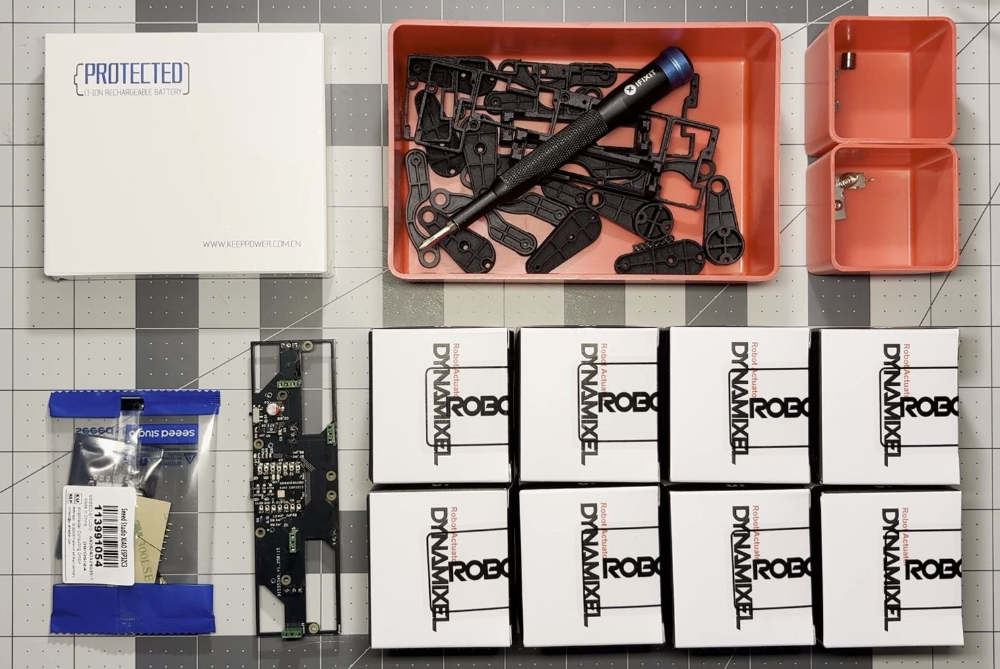
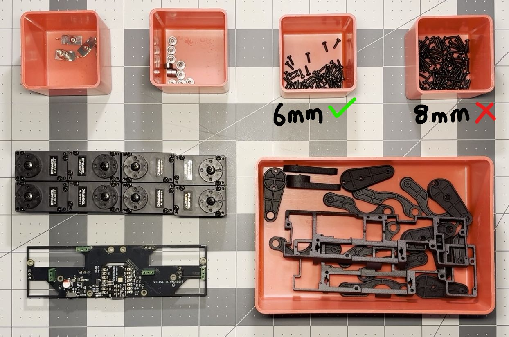
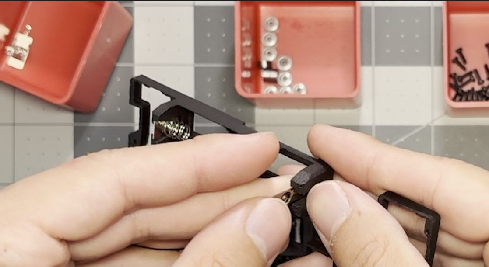
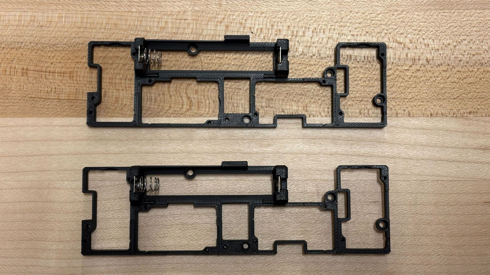
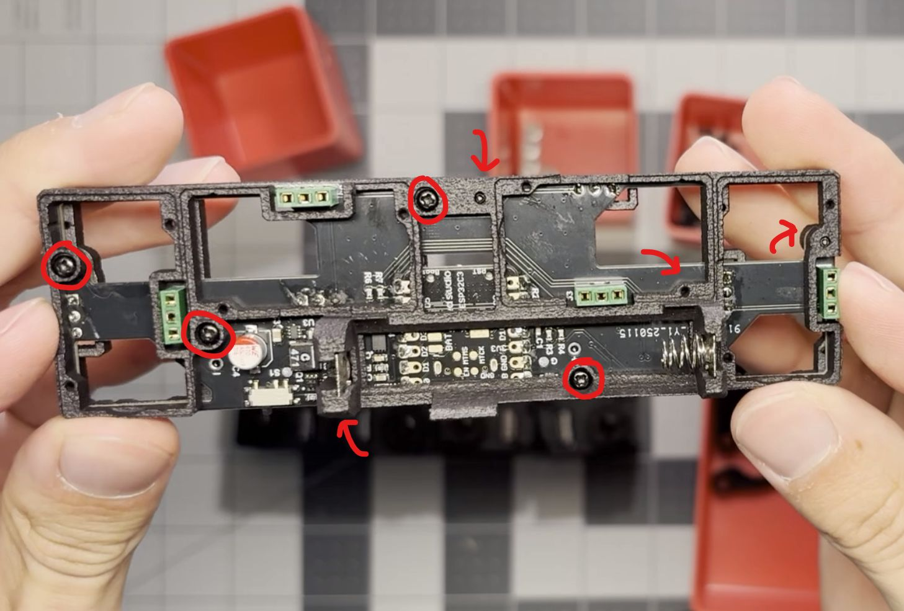
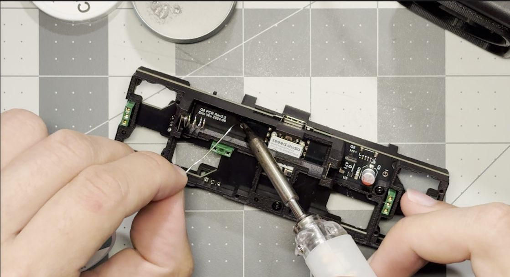
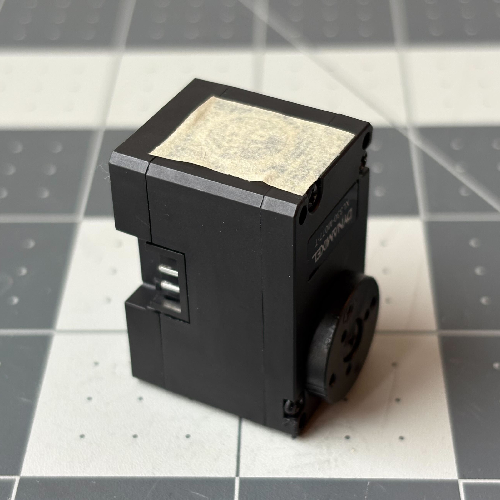
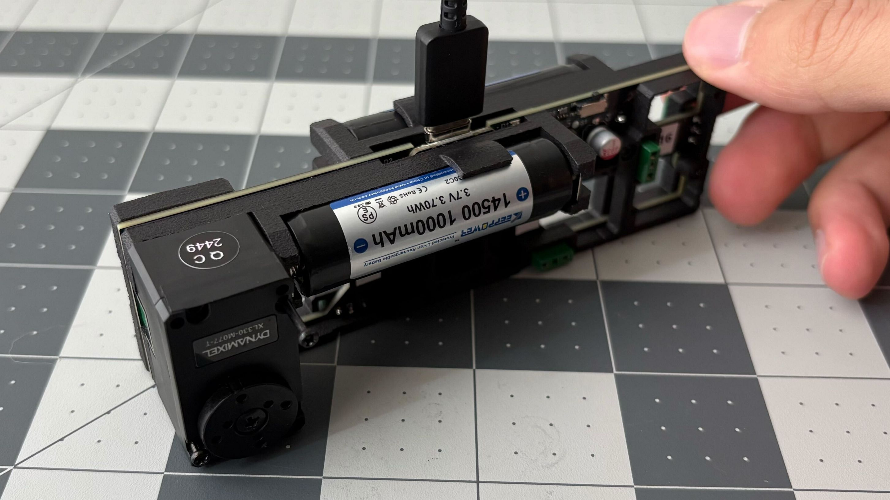
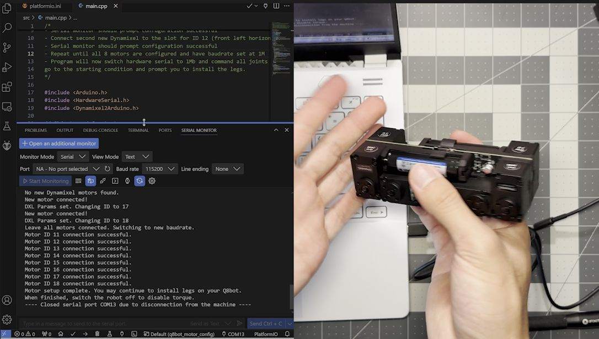

# Robot Assembly Instructions

[Sourcing Components](sourcing_components.md)

[**Assembling the Robot**]()

[Software Setup](software_setup.md)

[Back to Project Page](https://github.com/EricYufengWu/q8bot)

## Before You Begin:

- This instruction assume that you have either: (a) purchased the fully-assembled Q8bot PCB from PCBWay, or (b) reflow soldered the PCB yourself following the information found in the [`/PCBA`](../PCBA/) folder.

- If you are stuck or find the instruction confusing, please refer to the latest CAD model. If you still have trouble understanding, feel free to contact the author for clarification.

- If you are assembling the robot with brand new DYNAMIXEL motors, have a laptop ready to upload a simple firmware for motor configuration.

## Assembly Time!

1. Gather your components. From left right, top to down:
    - 2x Lithium-ion batteries
    - 3D-printed parts
    - 12x 692ZZ ball bearings
    - Battery clips
    - Separate Seeet Studio XIAO ESP32C3 (connect to PC for wireless control)
    - Fully-assembled Q8bot PCB
    - 8x brand new Dynamixel XL330-M077-T (which contains the screws needed for assembly)
<p align="center">
    
</p>

* Here is another look at the components with all package removed. Note that we will only use the 6mm screws that came with the DYNAMIXEL motors. It would be a good idea to start charging your batteriesso that they will be ready later in the assembly process.
<p align="center">
    
</p>

2. Attach battery clips to the main frames. Double-check location: If holding the part with the battery geometry on the left side as shown, the negative clip (with spring) should be on the left side and the positive clip (flat) should be on the right, with the notch facing inward. Repeat this step for the second, identical frame.
<p align="center">
    
</p>
<p align="center">
    
</p>

3. Attach the main frame to the center PCB using 8 M2x6mm self-tapping screws that came with the DYNAMIXEL motors.
<p align="center">
    
</p>
<p align="center">
    
</p>

4. Solder the battery clips to the PCB. Be careful not to melt the 3D-printed frame parts. Using some solder flux could be helpful.
<p align="center">
    
</p>

5. Insert ball bearings to the 3D-printed leg links (total: 12 bearings). You might need the back of the screwdriver to lightly push the bearings in.
<p align="center">
    
</p>

6. Assemble legs **(2 pairs that are mirrored to each other)** and set them aside. Each leg uses 3 M2x6mm screws. It might be helpful to first orient the leg parts following the image below without screws, in order to understand the small differences between some parts. Refer to the CAD model for better clarification. When finished, put the assembled legs aside and we'll come back to them later.
<p align="center">
    
</p>

- For each leg, position the leg elements as indicated and insert the bottom screw. Flip this setup and install the other 2 screws.
<p align="center">
    
    
</p>

7. We will move onto installing the DYNAMIXEL motors. To make handling the motors easier in the following steps, it is recommended to place a piece of tape on each motor between in the location indicated below. Detach the bottom shells from ALL 8 motors by loosening the 4 screws as shown in the following image, exposing the electronics. The tape we applied earlier will help prevent the top shells from falling off.
<p align="center">
    
    
</p>

8. Install the batteries. Make sure the negative side goes to the clip with spring, and the positive side goes to the flat clip.

9. Locate the switch and slide it toward the USB-C port to turn on the power. If your PCB has been assembled correctly, you should see the onboard LED of the Seeed Studio XIAO board light up.

**Note: The following motor setup instructions only works if you have brand new DYNAMIXEL motors that has not been configured before. If you are re-using the motors from previous projects, you will have to manually configure them using by following this instruction: [DXL_config_manual](DXL_config_manual.md).**

10. The next steps involve the use of [PlatformIO](https://platformio.org/) on Microsoft Visual Studio Code to configure the smart servo motors. If you haven't used it before, please refer to their official documentation and tutorials to setup the environment. Download or clone the q8bot repository to open this folder: `firmware/q8bot_motor_config`. With your battery installed and power turned on, connect your Q8bot PCB to your laptop using a USB-C cable.

11. Select the correct COM port by clicking the button circled in read, or leave it as "Auto" which will detect the correct port most of the time.
<p align="center">
    
</p>

12. Upload the q8bot_motor_config firmware to the Q8bot PCB by clicking the button with an arrow shape (circled in read).
<p align="center">
    
</p>

13. If upload is successful, proceed to open the serial monitor by clicking the button with the shape of a cable plug.
<p align="center">
    
</p>

14. In the serial monitor, you should see the message "No new Dynamixel motors found" being printed out every 5 seconds or so.
<p align="center">
    
</p>

15. We will be attaching the motors and configuring each of them at the same time. Grab one of the new motors with its back shell removed, and locate the location of the PCB marked with "ID 11" (the latest published Gerber should have the IDs printed on the silkscreen layer as opposed to a separate label as shown in the image).
<p align="center">
    
</p>

16. Align the PCB headers with the motor pins and install the first motor without screwing the motor in place. As soon as the first new motor is connected, you should see the following message in the laptop's serial monitor: 

    ```New motor connected! DXL Params set. Changing ID to 11.```
<p align="center">
    
</p>

17. You may now use the long screws from detaching the shells to secure the first motor in place. Note that only 2 screws are needed instead of 4.
<p align="center">
    
</p>

18. Repeat steps 15-17 for the remaining motors: ID12 - ID18. Reminder to follow the labeling numbers sequentially, as the calibration code is written to only look for the next available motor.
<p align="center">
    
</p>

19. Once all motors are connected, the program should automatically move all motors in preparation for leg installation. You may disconnect the robot from the laptop now, but keep it powered on.
<p align="center">
    
</p>

20. Install the legs. Make sure one identical pair of legs is installed on the left, and the other mirrored pair on the right. Refer to the CAD model of the robot if you find this confusing.
<p align="center">
    
</p>

Congratulations! You have finished assembling your Q8bot. You may turn off the robot power now, or directly proceed to [Software Setup](software_setup.md).