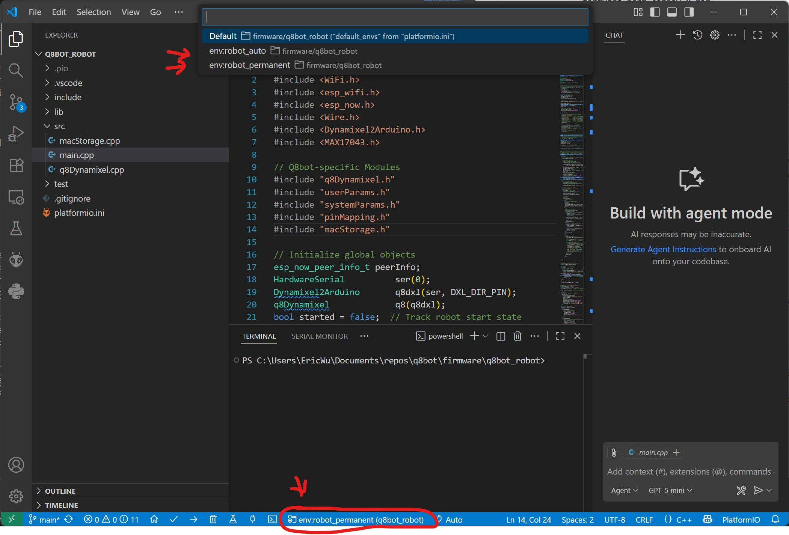
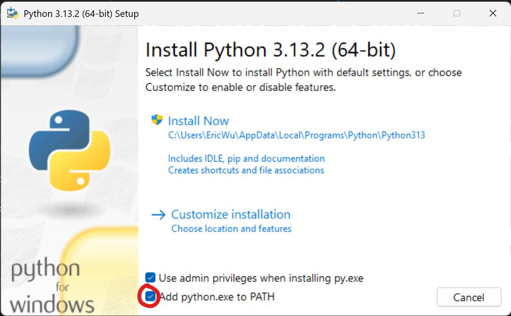
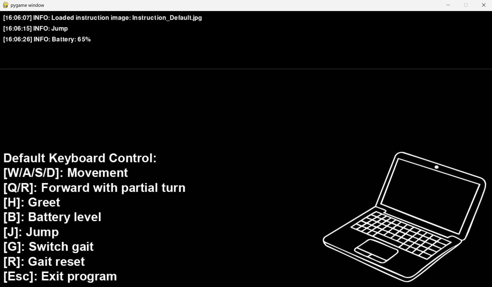
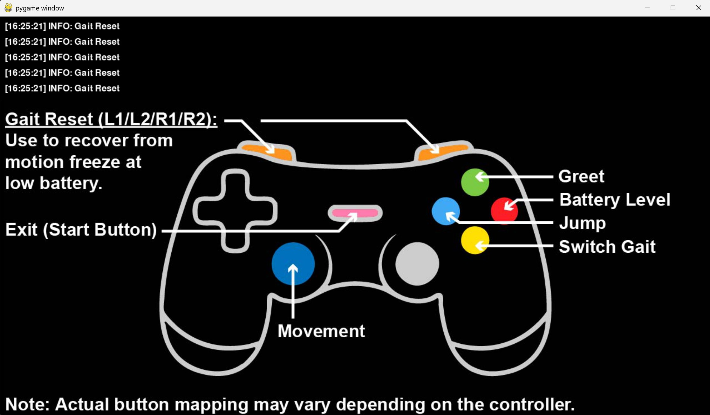

# Software Setup Instructions

[Sourcing Components](sourcing_components.md)

[Assembling the Robot](robot_assembly.md)

[**Software Setup**]()

[Back to Project Page](https://github.com/EricYufengWu/q8bot)

## Software Overview

Please excuse my messy code as I am a mechanical engineer by training :D

Currently, all computation regarding gait generation and FK/IK happens on the laptop. The laptop talks to the robot remotely via another Seeed Studio XIAO ESP32C3, sending raw joint angles as rapidly as possible using the ESPNow protocol. In the future, the hope is to move the gait generation code to the robot's onboard ESP32 for improved control.

    

## Seeed Studio XIAO MCU Setup (Robot + Controller)

Different firmware need to be uploaded to Q8bot (subsequently called **"robot"**) and the separate Seeed Studio XIAO ESP32C3 connected to your host laptop (subsequently called **"controller"**). 

If you check the latest project release, you will notice that we have two available sets of firmware: `firmware-perm-espnow-x.bin` and `firmware-auto-espnow-x.bin`. The following table summarizes their differences:

|                           | `firmware-perm-espnow-x.bin` | `firmware-auto-espnow-x.bin` |
|---------------------------|----------------------------|----------------------------|
| First time pairing        | Controller automatically pairs with the first robot it sees. Both devices store their counterpart's MAC address in the NVS memory (stays there after reset)| Same as `firmware-perm-espnow-x.bin` |
| How to un-pair and repair | Manually send 'p' via serial monitor to both the controller and the robot| Both devices will automatically attempt to find new devices and re-pair after a 5-second timeout. |
| Use this if...            | You want multiple robot-controller pairs to work reliably, such as in a class room setting **(I generally recommend to start with this)** | If you want one controller on multiple robots without manually un-pairing every time (gets messy with 2 or more pairs running at the same time) |

The microcontroller part of the code is developed in [PlatformIO](https://platformio.org/). If you haven't used it before, please refer to their official documentation and tutorials to setup the environment. Someone has also tried converting PlatformIO projects to Arduino IDE script [here](https://runningdeveloper.com/blog/platformio-project-to-arduino-ide/).

Upload `firmware/q8bot_robot` to the Q8bot robot, and upload `firmware/q8bot_controller` to the Q8bot controller. The process will be similar to steps 10 - 13 in [Robot Assembly](robot_assembly.md). Make sure you have selected your desired build (perm vs auto) as shown in the screenshot below.The default is robot_permanent/controller_permanent.

    

For advanced users, the quickest way to upload the firmware is by using [esptool](https://docs.espressif.com/projects/esptool/en/latest/esp32/) from Espressif. Replace `COM9` with the actual port that your device shows up as.  

    python -m esptool --port COM9 write_flash 0x10000 .\firmware-perm-espnow-robot.bin

    python -m esptool --port COM9 write_flash 0x10000 .\firmware-perm-espnow-controller.bin

## [Experimental] Running Q8bot Using the Standalone Executable
In the latest release, you will find a `q8bot_operate.exe` file, which allows you to skip all the Python setup and run Q8bot directly. Simply download the executable, plug in your controller to the laptop, turn on your robot, and double-click the executable. Wait until you see a blank screen named "pygame" appear, and you will be able to control the robot using the same keyboard commands listed later in this document.

Please note that this method has not been thoroughly tested and may contain more bugs. It also only works if you have a Windows machine. For the alternative (classic) method, please proceed to setting up python in your host laptop to run the program. This would be a better learning opportunity, too!

## Python Setup
Install python locally on your computer if you have not already. The simplest way is through the [official website](https://www.python.org/downloads/) (the latest version will do). **Make sure to check the "add python.exe to PATH" option.**

    

It's is best to set up a virtual environment to prevent dependency conflicts between different projects.

Using a terminal of your choice, navigate to the `/python-tools` folder and run the following to create a virtual environment for your project:

    python -m venv venv

In the same directory, activate the virtual environment (the command is different for macOS/Linux).

    .\venv\Scripts\activate

In the same directory, run the following:

    pip install --upgrade --force-reinstall -r requirements.txt

This will force install necessary dependencies in your venv only (there aren't a lot so you may have already had all libraries installed). For some systems, the above command might not work, in which case you may manually use `pip` to install the libraries.

## Running the Robot
Attach the batteries to the robot (double-check polarity!). Power on the robot with the onboard slide switch and you should see the onboard LED light up.

Plug in the controller board to your laptop/PC.

Navigate to `/python-tools/q8bot` folder and run:

    python operate.py

If everything works, a Pygame window should open with two partitions:

- Top panel: live debug info
- Bottom panel: a static image with keyboard controls

Make sure the Pygame window has focus (click on it). On launch, the robot will move its joints to their initial (home) positions. 

A quick note on **[R]**: This is useful when you notice the robot's movement suddenly becomes super slow (temporary fix to a know bug, possible EE-related). If you have to frequently do this, the robot's battery may be low.

    

If a joystick (USB or Bluetooth) is connected, a different Pygame screen appears showing button mappings and live input status.

    

Have fun!

## Common Issues

**Q: Pygame window launches but the robot is not moving with my command**

A: Try restarting the robot, re-inserting the dongle, and rerun the python script. If you are still having trouble, follow the steps below to initiate a "force repair":
- Connect both the robot and the dongle to your laptop.
- Open two separate serial monitors (you can use the "Serial Monitor" plugin from VSCode). 
- In both windows, type 'd' to turn on debugging for both devices.
- Type 'p' to each device to turn on pairing mode. You should see successfull pairing message from their serial monitors.

## Appendix

Here's a rough overview to the logic behind the python script (might not be accurate as I keep adding features)

