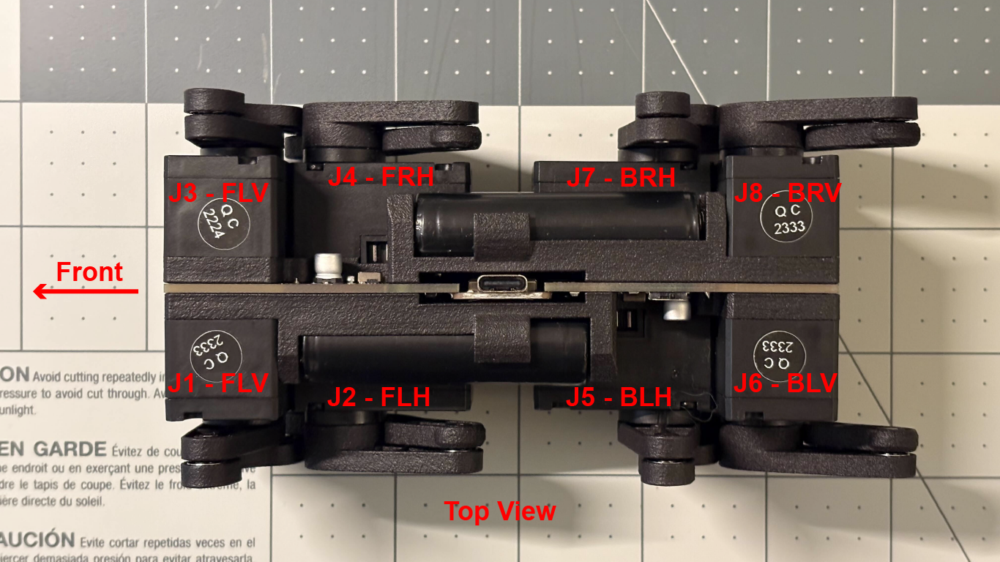

# Manual Dynamixel Motor Configuration

## Identify the front of the robot:
The "Front" silkscreen marking on the front side of the PCB is the front of the actual robot. When the robot is pointing forward, the Seeed XIAO board and most of the electronics are facing left.

## Robot joint assignment
**Note: J1-J8 markings on the PCB are for the PCB only. For the remaining of this doc, please follow the robot image above for actual joint assignment.**

Using Dynamixel Wizard 2.0 and an U2D2 hub, configure each motor's ID, baudrate, and other parameters before mounting them to the robot.

J1 (front left vertical, FLV):  
ID = 11 
Baud Rate = 1000000 
Drive Mode = Time-based Profile 
Operating Mode = Extended Position control 
Homing Offset = 2048 
**(Only applies when mounting the legs)** When linkage points forward, position should read 360. 

J2 (front left horizontal, FLH): 
ID = 12 
Baud Rate = 1000000 
Drive Mode = Time-based Profile 
Operating Mode = Extended Position control 
Homing Offset = 4096 
When linkage points downward, position should read 450. 

J3 (front right vertical, FRV):  
ID = 13 
Baud Rate = 1000000 
Drive Mode = Time-based Profile, Reverse mode 
Operating Mode = Extended Position control 
Homing Offset = 2048 
When linkage points forward, position should read 360. 

J4 (front right horizontal, FRH): 
ID = 14 
Baud Rate = 1000000 
Drive Mode = Time-based Profile, Reverse mode 
Operating Mode = Extended Position control 
Homing Offset = 4096 
When linkage points downward, position should read 450. 

J5 (back left horizontal, BLH):  
ID = 15 
Baud Rate = 1000000 
Drive Mode = Time-based Profile 
Operating Mode = Extended Position control 
Homing Offset = 2048 
When linkage points forward, position should read 360. 

J6 (back left vertical, BLV): 
ID = 16 
Baud Rate = 1000000 
Drive Mode = Time-based Profile 
Operating Mode = Extended Position control 
Homing Offset = 4096 
When linkage points downward, position should read 450. 

J7 (bask right horizontal, BRH):  
ID = 17 
Baud Rate = 1000000 
Drive Mode = Time-based Profile, Reverse mode 
Operating Mode = Extended Position control 
Homing Offset = 2048 
When linkage points forward, position should read 360. 

J8 (back right vertical, BRV): 
ID = 18 
Baud Rate = 1000000 
Drive Mode = Time-based Profile, Reverse mode 
Operating Mode = Extended Position control 
Homing Offset = 4096 
When linkage points downward, position should read 450. 